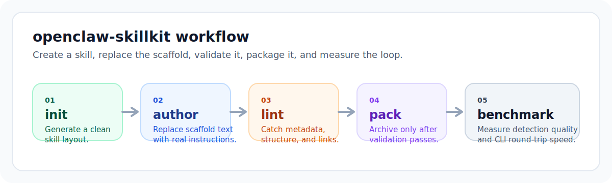

# SkillForge

<p align="center">
  
  
  
</p>

<p align="center"><strong>A polished toolkit for authoring, validating, packaging, inspecting, and reviewing reusable skills.</strong></p>

`SkillForge` turns skill authoring into a repeatable product workflow instead of a folder of markdown that drifts over time. It gives you one toolkit with two aligned surfaces: a strong CLI for day-to-day work and SkillForge Studio for demos, onboarding, and review.

<p align="center">
  
</p>

## At a Glance

| Area | What you get |
| --- | --- |
| `init` | Generate a consistent skill layout with optional `references/`, `scripts/`, and `assets/`. |
| `lint` | Catch weak metadata, placeholder copy, missing sections, and broken local references, with `--all` repo-wide validation for multi-skill maintenance. |
| `pack` | Create a `.skill` archive only after validation passes, with a manifest, repo-wide batch packaging, and optional report or index outputs for inspection and automation. |
| `inspect` | Read one archive or a whole artifact directory back out, verify contents, preview bundled files, compare against prior releases, and export audit-ready reports or persisted indexes. |
| `review` | Run a release-readiness pass for one skill or a whole repo, package clean artifacts, verify source parity, optionally compare against prior releases, and emit handoff-ready reports or persisted indexes. |
| `serve` | Launch SkillForge Studio for demos, examples, linting, packaging, and archive inspection. |
| `benchmark` | Measure fixture detection quality and CLI round-trip performance with repeatable runs. |

## One Toolkit, Two Surfaces

Use the CLI when you want speed and scripting. Use SkillForge Studio when you want a clearer authoring flow, example-driven onboarding, or a more legible demo for other people. Both surfaces run the same real workflow:

1. initialize or load a skill
2. lint it with concrete fix guidance
3. package a `.skill` archive
4. inspect or review the shipped artifact

## Why This Exists

Most skill repos lose trust for predictable reasons:

- every new skill starts from a slightly different structure
- `SKILL.md` metadata is vague, missing, or left half-scaffolded
- local references drift and break later
- packaging becomes manual, so validation gets skipped
- quality debates stay subjective because nobody runs the same checks

`SkillForge` keeps the workflow small: create, author, lint, pack, inspect, benchmark.

## Quickstart

Requirements: Node.js 22+

Install dependencies and verify the baseline:

```bash
npm install
npm run verify
```

Launch the local studio if you want the guided authoring workflow:

```bash
npm run ui
```

Create a skill, edit it, validate it, and package it:

```bash
npx skillforge init skills/customer-support --template scripts
$EDITOR skills/customer-support/SKILL.md
npx skillforge lint skills/customer-support
npx skillforge pack skills/customer-support --output ./artifacts/customer-support.skill
npx skillforge pack skills --all --output-dir ./artifacts/release --index --report
npx skillforge inspect ./artifacts/customer-support.skill
npx skillforge review skills/customer-support --output ./artifacts/customer-support.skill --report
```

If you want to use the checked-in build directly:

```bash
node dist/cli.js lint examples/weather-research-skill
node dist/cli.js lint examples/customer-support-triage-skill
node dist/cli.js lint examples/release-notes-skill
node dist/cli.js pack examples/weather-research-skill
node bench/index.js --iterations 3
```

## Local Studio

`skillforge serve` starts a lightweight local web interface on `http://127.0.0.1:3210` by default. It uses the same real workflow as the CLI, not mocked demo actions.

SkillForge Studio is designed to feel like the product surface for the toolkit, not a separate experiment. It makes the path through skill authoring explicit:

- start from an example or scaffold a new skill
- see the current workflow status at a glance
- get clearer empty states and recommended next actions after each operation
- prefill a new skill scaffold from a checked-in example's structure and metadata
- move directly from packaging into archive inspection without re-entering paths
- compare a new archive against the current source or a previous shipped artifact from the same inspect panel
- preview a bundled file such as `SKILL.md` directly from the packaged archive
- include a previous shipped artifact in the review flow to capture release deltas before handoff

Use it to:

- scaffold a new skill with template and resource options
- compare examples, preload their paths, and prefill a matching scaffold
- lint a local skill directory and review fix guidance
- package a `.skill` archive and inspect the bundled manifest
- compare an archive against a previous `.skill` to review release deltas before handoff
- run one release-readiness review that combines lint, packaging, and artifact verification

Run it with either command:

```bash
npm run ui
skillforge serve --port 3210
```

## Workflow

### 1. Start from a real scaffold

`init` creates a ready-to-edit skill directory instead of another ad hoc markdown file.

```bash
skillforge init skills/customer-support \
  --name customer-support \
  --description "Skill for support triage workflows" \
  --template scripts
```

Template modes:

- `minimal`: `SKILL.md` only
- `references`: adds `references/`
- `scripts`: adds `references/` and `scripts/`
- `full`: adds `references/`, `scripts/`, and `assets/`

`--resources references,scripts,assets` still works and is merged with the selected template mode.

Resulting structure:

```text
skills/customer-support/
├── SKILL.md
├── assets/
│   └── README.txt
├── references/
│   └── README.md
└── scripts/
    └── example.sh
```

The generated `SKILL.md` now includes practical sections for `Inputs`, `Output`, and a short customization checklist so authors can move from scaffold to reviewable skill with fewer guesswork edits.

If you are not sure where to start, use the examples as authoring blueprints instead of copying folders manually:

```bash
skillforge init ./skills/weather-research-skill --template scripts
skillforge init ./skills/customer-support-triage-skill --template references
```

SkillForge Studio now surfaces the same adaptation path directly in each example card, including a prefilled create form, the recommended template, and the first workflow step to borrow.

### 2. Catch trust-breaking issues early

`lint` checks the failure modes that usually make skills hard to review or reuse:

- missing or malformed `SKILL.md`
- missing `name`, `description`, or `version` frontmatter
- invalid slug-style skill names
- invalid semver-like versions
- placeholder descriptions or scaffold body copy left in place
- missing headings that make the workflow hard to follow
- broken local file references, including links that escape the skill root
- stable issue codes and fix suggestions for every finding
- focus-area summaries and next-step guidance for authors and CI consumers
- JSON output for CI, editor extensions, and custom tooling
- batch mode (`--all`) to lint every skill under a root path in one pass
- cross-skill duplicate-name detection so repos do not ship conflicting skill identities
- optional markdown report export (`--report`) for async review handoffs

```bash
skillforge lint skills/customer-support
npx skillforge lint skills/customer-support --json
skillforge lint skills --all --report
```

Example success output:

```text
Linting /tmp/skillforge-repo/examples/weather-research-skill
Status: READY TO PACKAGE
Summary: 0 error(s), 0 warning(s), 1 file(s) checked.
  Confidence: no blocking issues or warnings were found.
Next:
  1. Pack when ready: skillforge pack /tmp/skillforge-repo/examples/weather-research-skill
  2. Run a full review before handoff: skillforge review /tmp/skillforge-repo/examples/weather-research-skill
```

Example actionable failure output:

```text
Linting /tmp/skillforge-repo/test/fixtures/invalid/bad-version-skill
  ERROR [invalid-frontmatter-version] SKILL.md: Frontmatter version must look like semver. Received "version1".
    Fix: Use a semver-style version such as "0.1.0" or "1.2.3-beta.1".
Summary: 2 error(s), 2 warning(s), 1 file(s) checked.
Next:
  1. Fix blocking metadata issues first. Update the SKILL.md frontmatter so name, description, and version clearly identify the skill.
  2. Then review structure warnings. Add the standard sections and make the workflow easy to follow as numbered steps.
  3. Re-run: skillforge lint /tmp/skillforge-repo/test/fixtures/invalid/bad-version-skill
```

Example JSON output:

```json
{
  "skillDir": "/tmp/skillforge-repo/test/fixtures/invalid/bad-version-skill",
  "fileCount": 1,
  "summary": {
    "total": 4,
    "errors": 2,
    "warnings": 2
  },
  "focusAreas": [
    {
      "category": "frontmatter",
      "label": "Metadata",
      "errors": 2,
      "warnings": 1,
      "suggestion": "Update the SKILL.md frontmatter so name, description, and version clearly identify the skill."
    }
  ],
  "nextSteps": [
    "Fix blocking metadata issues first. Update the SKILL.md frontmatter so name, description, and version clearly identify the skill.",
    "Then review structure warnings. Add the standard sections and make the workflow easy to follow as numbered steps.",
    "Re-run: skillforge lint /tmp/skillforge-repo/test/fixtures/invalid/bad-version-skill"
  ],
  "issues": [
    {
      "level": "error",
      "code": "invalid-frontmatter-version",
      "category": "frontmatter",
      "file": "SKILL.md",
      "message": "Frontmatter version must look like semver. Received \"version1\".",
      "suggestion": "Use a semver-style version such as \"0.1.0\" or \"1.2.3-beta.1\"."
    }
  ]
}
```

### 3. Package only when a skill is ready to ship

`pack` runs lint first and refuses to create a `.skill` archive if blocking errors exist. It also skips nested `.skill` files and writes `.skillforge/manifest.json` into the archive so adopters can inspect exactly what was bundled, including per-file sizes and hashes.

```bash
skillforge pack skills/customer-support
skillforge pack skills/customer-support --output ./artifacts/customer-support.skill
skillforge pack skills/customer-support --report
skillforge pack skills/customer-support --output ./artifacts/customer-support.skill --json
skillforge pack skills --all --output-dir ./artifacts/release --index --report
```

If you are already inside a skill directory:

```bash
skillforge pack
```

Example success output:

```text
PACKAGED SUCCESSFULLY
Archive ready: /tmp/skillforge-repo/artifacts/customer-support.skill
  Skill: customer-support@0.1.0 (4 bundled file(s) plus manifest, 1.3 KB).
  Confidence: the archive includes an embedded manifest for later inspection.
  Contents: SKILL.md, references/README.md, scripts/example.sh, assets/README.txt
Next:
  1. Inspect the shipped artifact: skillforge inspect /tmp/skillforge-repo/artifacts/customer-support.skill
  2. Verify source parity: skillforge inspect /tmp/skillforge-repo/artifacts/customer-support.skill --source ./path-to-skill
```

Use `--report` to write a Markdown handoff summary next to the archive by default, or pass an explicit path such as `--report ./artifacts/customer-support.report.md`.

`pack --json` emits archive metadata for CI artifacts, release automation, editor tooling, and release note pipelines. The JSON payload now also includes the generated report markdown and report path when requested.

For maintainers packaging multiple skills at once, `pack --all` walks every skill under a root path, blocks only the skills with lint errors, and prevents duplicate frontmatter names from shipping in the same batch. Its text and JSON outputs add a lean operational view with:

- packaged vs blocked skill counts
- artifact inventory totals such as archive bytes, bundled file counts, and largest archives
- issue hotspots across the repo so cleanup work is easier to prioritize
- an optional persisted JSON index via `--index` for release scripts or downstream automation

That gives teams a practical release-helper path when they want packaged artifacts and a machine-readable batch summary without running the fuller source-parity checks in `review --all`.

### 4. Inspect the final artifact before publishing

Use `inspect` to verify the packaged manifest instead of trusting a zip file blindly:

```bash
skillforge inspect ./artifacts/customer-support.skill
skillforge inspect ./artifacts/customer-support.skill --source ./skills/customer-support
skillforge inspect ./artifacts/customer-support.skill --against ./artifacts/customer-support-prev.skill
skillforge inspect ./artifacts/customer-support.skill --entry SKILL.md
skillforge inspect ./artifacts/customer-support.skill --source ./skills/customer-support --against ./artifacts/customer-support-prev.skill
skillforge inspect ./artifacts/customer-support.skill --source ./skills/customer-support --report
skillforge inspect ./released-skills --all
skillforge inspect ./released-skills --all --baseline-dir ./previous-releases --index --report
skillforge inspect ./artifacts/customer-support.skill --json
```

Adding `--source` compares the archive to a current skill directory so you can catch drift before review or publication. That comparison reports:

- frontmatter metadata drift
- files that changed since packaging
- files missing from the current source
- new source files not present in the archive

The text, JSON, Studio, and Markdown report outputs now all include the same trust summary so reviewers can quickly see whether the manifest was verified, whether metadata still matches, and whether the archive still reflects the current source.

Adding `--against` compares the current archive against a previous `.skill` artifact so release reviewers can see:

- metadata changes such as version or description updates
- bundled files added since the previous release
- bundled files removed since the previous release
- bundled files that changed between artifacts

That release-delta view is available in the same text, JSON, Studio, and Markdown report outputs, so the handoff answer covers both "does this still match source?" and "what changed since the last shipped artifact?"

Adding `--entry` previews one bundled file directly from the archive so you can inspect `SKILL.md`, a guide in `references/`, or a shipped script without unpacking the artifact first.

Adding `--report` exports the same inspection as a Markdown review artifact that is easier to attach to release notes, share in PRs, or hand to reviewers who do not want raw JSON.

Adding `--index` in batch mode persists the full archive inventory as JSON, including an operations summary with duplicate release coordinates, version spread, changed archives, and missing baselines. That makes `inspect --all` easier to feed into release automation without scraping stdout.

For maintainers auditing a release directory, `inspect --all` walks every `.skill` archive under a root path and produces a repo-scale artifact inventory. That batch view highlights:

- duplicate release coordinates such as the same `name@version` shipped multiple times
- skill names that span multiple versions across one archive set
- the largest archives and largest bundled files
- common bundled paths across releases, which helps spot repeated heavy content
- optional baseline coverage, release-change hotspots, and orphaned prior artifacts when used with `--baseline-dir`

### 5. Run a release-readiness review before handoff

`review` is the lean preflight command for answering "is this skill actually ready to ship?" without manually chaining multiple steps. It:

- runs lint and summarizes blocking issues and warnings
- packages the skill when lint passes
- compares the packaged archive back to the current source directory
- optionally compares the packaged archive against a previous shipped `.skill`
- optionally writes a Markdown readiness report for handoff or release notes
- can run across a whole repo with `--all`, writing one artifact per skill plus a batch rollup

```bash
skillforge review skills/customer-support
skillforge review skills/customer-support --against ./artifacts/customer-support-prev.skill
skillforge review skills/customer-support --output ./artifacts/customer-support.skill --report
skillforge review skills --all --output-dir ./artifacts/review
skillforge review skills --all --baseline-dir ./released-skills --index --report
skillforge review skills/customer-support --json
```

If blocking lint errors remain, `review` exits non-zero and does not create an archive. When the skill is ready, the report captures both authoring quality and artifact trust in one place. Adding `--against` folds release delta review into that same pass so handoff notes stay attached to the actual artifact being shipped.

For multi-skill repos, `review --all` closes the gap between batch lint and real release prep. It discovers every skill under the target root, writes review artifacts into one directory, keeps going even when some skills are blocked, and produces a rollup that answers which skills are ready, which still need work, and which changed versus a baseline release directory.

That batch review output now also includes maintainer-focused rollups across CLI, JSON, and exported Markdown:

- artifact inventory totals such as archives created, bundled file counts, total bytes, and the largest review artifacts
- release hotspots that show which bundled paths and metadata fields changed most often across the repo
- issue hotspots that surface the most common lint failures without reading every per-skill section
- baseline coverage reporting that calls out missing baselines and orphaned release artifacts sitting in the baseline directory

When you add `--index` to `review --all`, SkillForge also writes the batch result to JSON next to the review artifacts by default. That saved index includes a compact operations summary listing ready skills, blocked skills, release changes, missing baselines, and any drifted artifacts so CI or handoff scripts can act on the batch result directly.

The result is still one compact scorecard, but it reduces the manual digging that usually happens before repo-wide release handoff.

## Commands

| Command | Purpose |
| --- | --- |
| `skillforge help` | Show CLI help. |
| `skillforge help init` | Show scaffold options and flags. |
| `skillforge help lint` | Show lint modes, including JSON output, repo-wide `--all`, and report export. |
| `skillforge help pack` | Show single-skill packaging plus repo-wide batch packaging, JSON reporting, index export, and report export. |
| `skillforge help inspect` | Show single-archive inspection plus repo-scale archive inventory, baseline comparison, entry preview, and report export usage. |
| `skillforge help review` | Show single-skill and repo-scale review workflows, including baseline comparison and report export usage. |
| `skillforge help serve` | Show local studio host and port options. |
| `skillforge serve` | Start SkillForge Studio. |
| `npm run benchmark -- --help` | Show benchmark runner flags. |
| `npm run check` | Type-check without emitting build output. |
| `npm run build` | Compile the CLI into `dist/`. |
| `npm run verify` | Run the full local verification pipeline. |

## Example Skills

| Example | Focus |
| --- | --- |
| [`examples/weather-research-skill/`](examples/weather-research-skill/) | Grounded trip-planning research with references and scripts. |
| [`examples/customer-support-triage-skill/`](examples/customer-support-triage-skill/) | Support queue routing and escalation. |
| [`examples/release-notes-skill/`](examples/release-notes-skill/) | Turning engineering change notes into customer-facing launches. |

## Quality Pipeline

The repo keeps the trust boundary explicit:

- `pack` is gated by lint, so broken skills do not get archived by accident, and `pack --all` adds a lean repo-scale packaging flow with duplicate-name blocking and an optional batch index for automation
- packaged archives include skill metadata plus per-file sizes and hashes, and avoid recursively bundling old `.skill` artifacts
- `inspect` lets authors and reviewers confirm the manifest from the built artifact itself, compare it against the current source directory for drift, compare it against a previous shipped artifact for release deltas, preview bundled files, and export a review-ready Markdown report
- `review` provides a single readiness verdict for one skill or a whole repo, covering lint status, archive creation, source-to-artifact parity, release hotspots, artifact inventory, and optional baseline coverage / release delta review before handoff
- fixture-driven tests cover parsing, linting, CLI behavior, and archive contents
- `npm run verify` runs tests and benchmarks, and also typechecks plus rebuilds `dist/` when the local TypeScript compiler is available
- GitHub Actions runs the same `npm run verify` command on pushes and pull requests

Run the full local pipeline:

```bash
npm run verify
```

## Benchmarks

The benchmark suite covers both quality detection and CLI workflow performance:

- `bench/run-detection-benchmark.js` scores good-vs-bad skill detection using labeled fixtures in [`test/fixtures/benchmark/`](test/fixtures/benchmark/)
- `bench/run-cli-benchmark.js` measures a repeatable CLI round trip: linting the example skill and running `init -> lint -> pack`
- `npm run benchmark -- --json --output ./artifacts/benchmark.json` exports machine-readable results for CI artifacts or before/after comparisons

Human-readable output looks like this:

```text
Benchmark summary
  Detection: 5/5 correct (100.0%), precision 100.0%, recall 100.0%
  CLI lint x5: min 38.0ms, p50 40.2ms, avg 41.1ms
  Round trip x5: min 145.0ms, p50 149.4ms, avg 151.0ms
```

## Why Teams Use It

- small surface area: three core CLI commands plus benchmarks
- no runtime dependencies
- checked-in `dist/` for direct use from the repo
- plain markdown and filesystem conventions instead of a larger platform

It is meant for teams that want a standard skill workflow quickly, without creating another internal toolchain project.
